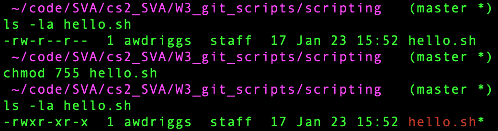

# Bash Scripting

## Pipes, &&, Redirects

## Simple Script 
- Use `touch hello.sh` to create a new file
- Open this file in a text editor. `atom hello.sh` if using atom.
- Let's type our first script!

```bash
echo Hello World
```

- Save the file and return to the terminal.
- Try `bash hello.sh`
- What just happened? We used bash to run the script! The `echo` command just prints to the screen whatever comes after it.

### chmod (Change Mode)
- We had to use `bash` to run the file. To make the command executable, we have to change the permissions.
- Type `chmod 755 hello.sh` 
- `chmod` means change mode. The 755 is changing what the permission are. In this case it is only editable by the owner, but can is executable by anyone.
- Now we can just type `./hello.sh` and the script will run. Why the `./`? This tells bash to look in this directory for the script, otherwise it will look in the `/bin` directory and it won't be there.
- See how the permissions change...


### Variables
- Variables are placeholders for values that might change throughout the script.
- Defining Variables &rarr; `FIRST_NAME=Adam`
- Variables have to start with a number, not a character 
- Using variables &rarr; `$FIRST_NAME` 
- NO SPACES! Before or after the =
- Need spaces? `FULL_NAME="Adam Driggers"` 
  
### Parameters
- Parameters come at the end of a shell command, example `cat file.txt`, the name of the file is a parameter sent to the `cat` command.
- We can use parameters in our scripts. 
- `$0` is the file path of where the script is being run.
- `$1` is the first parameter after the command, `$2` would be the second parameter, and so on.

### Exercise 1
- Create a simple script called `likes.sh`
- Example output `./likes.sh adam coffee` will print to the terminal `Adam likes coffee`

[LinkedIn Learning Course](https://www.linkedin.com/learning/learning-linux-shell-scripting-2018/passing-parameters?autoAdvance=true&autoSkip=true&autoplay=true&resume=false&u=56746073) Note: I borrowed heavily from this!
