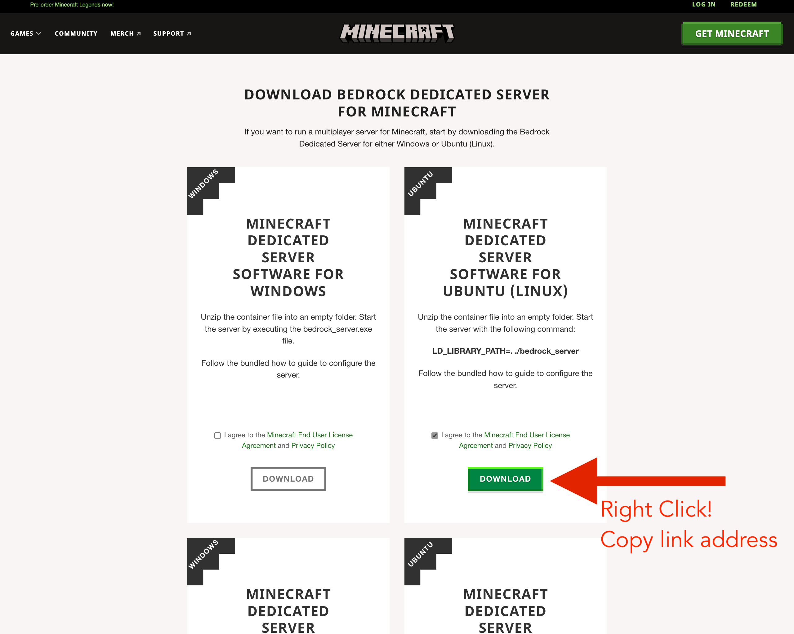

# Minecraft Bedrock Server
I'm going to use Digital Ocean, so first thing to do is spin up a new server. 

Copy the IP Address for this new server.

Follow the [initial server setup for Ubuntu](https://www.digitalocean.com/community/tutorials/initial-server-setup-with-ubuntu-22-04) to turn on a firewall and setup a non-root user with sudo privileges.

SSH into the new server using the non-root user.

Open up port 19132, this is what the bedrock minecraft server uses for incoming data.
```bash
sudo ufw allow 19132/udp
```
 
## Install Screen and Zip
We need two tools before we get started. Type this command to download [zip](https://linux.die.net/man/1/zip) and [screen](https://linux.die.net/man/1/screen)
```bash
sudo apt-get install zip screen -y
```


## Install the Minecraft Server
- In your browser, go the to [minecraft downloads page](https://www.minecraft.net/en-us/download/server/bedrock).
- Accept the terms and right click the download button, select "Copy Link Address"

- use `wget` to install the package.
```bash
wget LINK_YOU_JUST_COPIED
```
- Now you need to unzip what was just downloaded.
```bash
unzip bedrock-server-1.19.61.01.zip
```
- The server is ready to start! You can run the server as is using this command.
```bash
./bedrock_server
```
- Use your phone, switch, playstation, whatever, to check if you can connect to the server.

## Change the Game Properties
You can modify the game settings to change game modes, change difficulty, plus a lot more. 

If you feel comfortable with editing text using vim or nano, you can simply open the file and make the changes.
```bash
vim server.properties
```

Otherwise, from a local terminal window you can use `scp` to grab the file, edit with atom or your favorite editor, and transfer back to the server.

```bash
scp minecraft@67.205.137.247:/home/minecraft/server.properties ./
atom server.properties
scp server.properties minecraft@67.205.137.247:/home/minecraft/
```

Here is a [reference](https://minecraft.fandom.com/wiki/Server.properties#Bedrock_Edition) for all the server properties you can change.

## Restart the Server with Screen
Right now, if we start the server as we did earlier, then close the our terminal connection, the game server will stop and we won't be able to play minecraft. 

Instead we can use the `screen` command to run the server in the background, even when we disconnect.

```bash
screen ./bedrock_server
```

This will take you to a new screen, and start the server software. Press "CTRL-A" then "D" to exit this screen and return to the shell. Now we can safely exit our ssh connection and the server will keep running.

You can always return to the screen using `screen -r`.

## Leave and Play!
To disconnect from the ssh connection, simply type `exit`.

Use you device to connect to your Minecraft server and have a blast.

 
 
